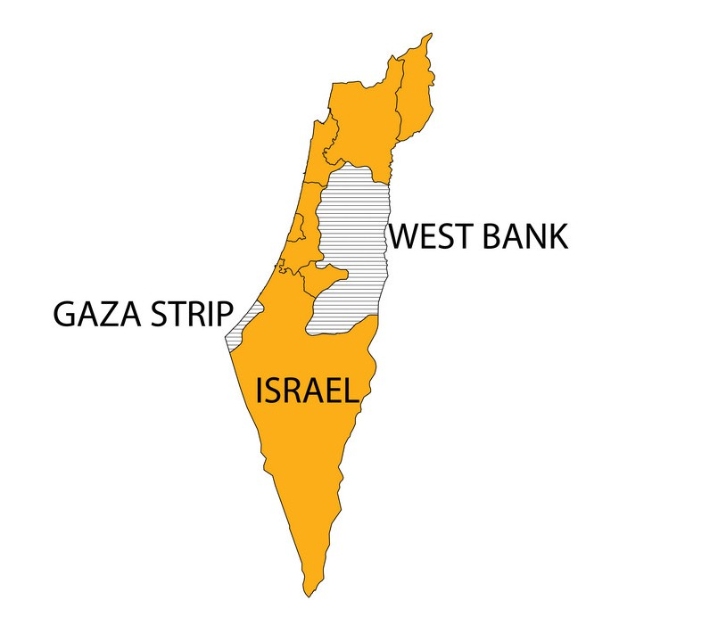

# Israeli-Palestinian-Conflict-Statistics-Project

## Un poco de historia y contexto.

El Conflicto Israelí-Palestino es el conflicto social y armado en curso entre israelíes y palestinos por el control de la región histórica de Palestina, que se remonta a principios del siglo XX.

Los primeros asentamientos judíos en estas tierras comenzaron en 1881, pero el antisemitismo nazi provocó una gran oleada en 1930. Con el paso de los años las comunidades judías asentadas en la zona fueron creciendo y se dispararon los enfrentamientos. Tras la Segunda Guerra Mundial, el 29 de noviembre de 1947, Naciones Unidas, a petición de Reino Unido, dividió el territorio asignando el 54% a los judíos y el 46% a los palestinos y dejó Jerusalén, ciudad clave para los dos pueblos, bajo régimen internacional. En ese momento se crearon los territorios palestinos de Gaza y Cisjordania (West Bank).

Los judíos aceptaron el plan de partición, mientras que los árabes lo rechazaron. Estalló entonces una guerra civil en el mandato entre judíos y árabes que desencadenó la expulsión o huida de dos tercios de la población árabe. El 14 de mayo de 1948, coincidiendo con la declaración de independencia de Israel, los Estados árabes vecinos declararon la guerra al recién creado Estado de Israel, aunque finalmente fueron derrotados por los israelíes. A la conclusión de la guerra, Israel se negó a aceptar el retorno de los más de 700.000 refugiados palestinos, que han vivido desde entonces en campamentos de refugiados y ciudades de Líbano, Siria, Jordania, la Franja de Gaza y Cisjordania, entre otros lugares. Israel pasó a ocupar el 77% del territorio palestino. 

A partir de entonces, el conflicto ha sido una constante en la región, con enfrentamientos armados y atentados terroristas por parte de ambos bandos. En el presente trabajo se analizarán los datos de muertes en el conflicto desde el año 2000 hasta el 2023, con el objetivo de identificar patrones y tendencias en la evolución de las fatalidades. Se cuenta con un [Dataset de Kaggle](https://www.kaggle.com/datasets/willianoliveiragibin/fatalities-in-the-israeli-palestinian) que contiene información sobre cada una de las muertes desde el año 2000 hasta septiembre de 2023, incluyendo la fecha, el lugar, la causa, la ciudadanía, la edad y otros datos interesantes que se estarán analizando.